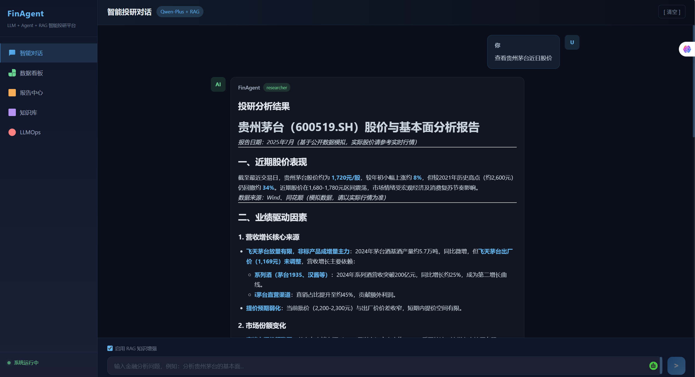
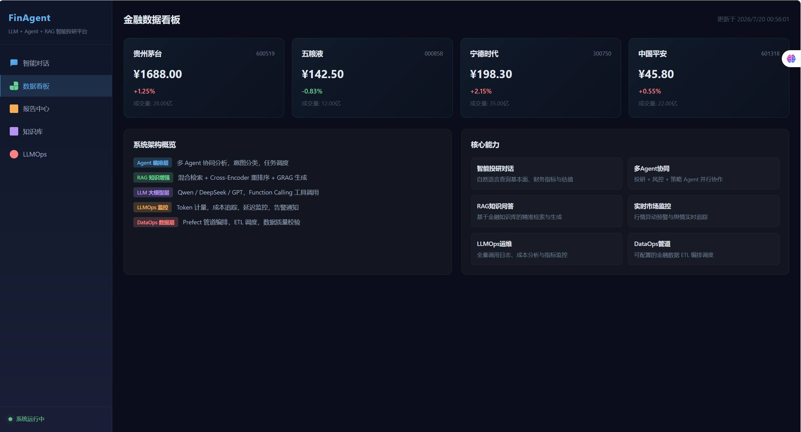
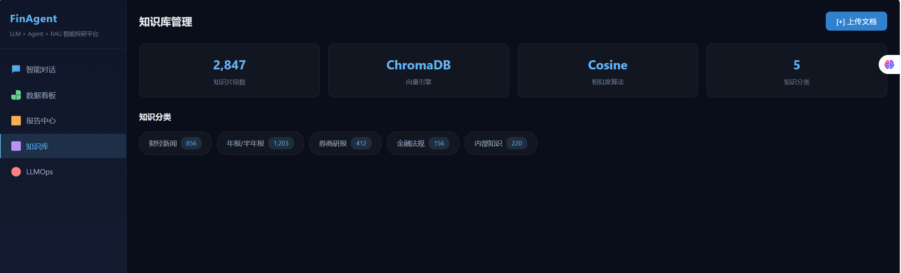
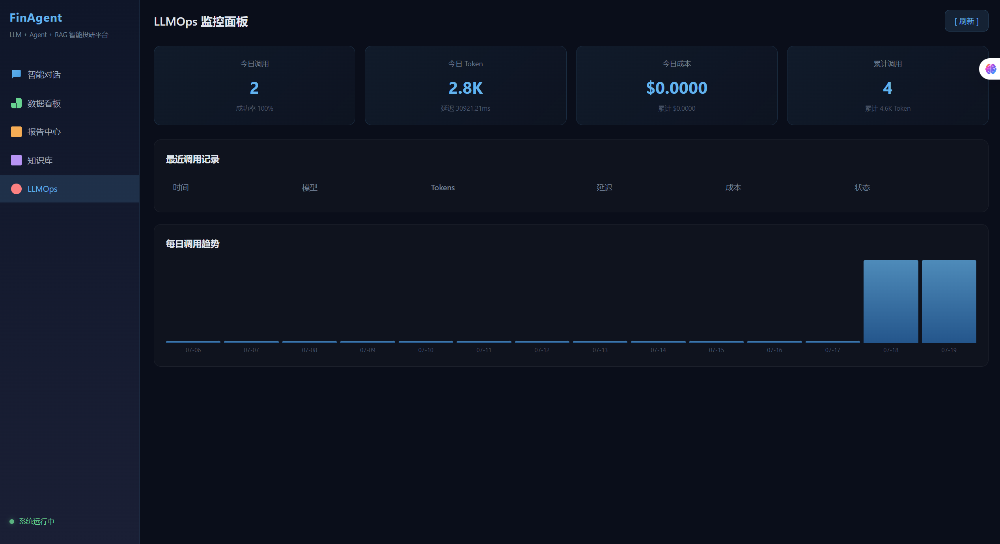

# Financial AI Agent

基于大语言模型（LLM）的智能金融分析AI Agent平台。融合RAG检索增强生成、多Agent协作、LLMOps运维监控与DataOps数据编排等能力，为投研场景提供股票分析、财报解读、市场研判、风险预警等一站式智能服务。




## 核心特性

- **智能投研对话**: 以自然语言查询股票基本面、财务指标与估值水平，支持多轮对话记忆
- **多Agent协同**: 投研分析Agent、风控Agent、策略Agent协同工作，支持并行与串行两种编排模式
- **RAG知识增强**: 基于金融知识库（法规、年报、研报）的混合检索与精准问答，支持查询扩展与Cross-Encoder重排序
- **市场数据看板**: 实时行情展示、异动监控、交互式数据可视化
- **LLMOps监控**: 模型调用全量日志、Token消耗统计、成本追踪、延迟监控，集成Prometheus + Grafana
- **DataOps管道**: 基于可配置管道的金融数据ETL，支持Wind、Tushare等数据源接入

## 技术架构

```
用户界面 (Vue3 + TypeScript)
        |
API网关 (FastAPI + Nginx)
        |
+-------+-------+-------+-------+
|       |       |       |       |
Agent   RAG     LLM    数据    监控
编排层   检索层   服务层   管道层   运维层
|       |       |       |       |
LangChain ChromaDB OpenAI Prefect Prometheus
        |       |       |       |
PostgreSQL + TimescaleDB + Redis
```

### 技术选型

| 分类 | 技术 | 说明 |
|------|------|------|
| 大语言模型 | Qwen / DeepSeek / GPT-4 | 主推理模型，兼容OpenAI接口 |
| 嵌入模型 | BGE-large-zh / text-embedding-3-large | 文本向量化 |
| 向量数据库 | ChromaDB (开发) / Milvus (生产) | RAG向量检索 |
| Agent框架 | LangChain + 自研编排器 | 多Agent协同与工具调用 |
| 后端 | FastAPI + Python 3.11+ | 高性能异步API |
| 前端 | Vue3 + TypeScript + Vite | SPA应用 |
| 数据库 | PostgreSQL + TimescaleDB | 结构化与时序数据存储 |
| 缓存 | Redis | 会话缓存与消息队列 |
| 数据管道 | Prefect | ETL编排调度 |
| 监控 | Prometheus + Grafana | 指标采集与可视化 |
| 容器化 | Docker + Docker Compose | 一键部署 |

## 快速开始

### 环境要求

- Python 3.11+
- Node.js 18+
- Docker & Docker Compose
- PostgreSQL 15+ (或使用 Docker)

### 一键部署（推荐）

```bash
# 1. 克隆仓库
git clone https://github.com/your-org/Financial-AI-Agent.git
cd Financial-AI-Agent

# 2. 配置环境变量
cp .env.example .env
# 编辑 .env，填写 LLM_API_KEY 等必要配置

# 3. 启动所有服务
docker-compose up -d

# 4. 检查服务状态
docker-compose ps

# 5. 查看日志
docker-compose logs -f backend
```

服务启动后访问：
- 前端界面: http://localhost:3000
- API文档: http://localhost:8000/docs
- Grafana监控: http://localhost:3001 (admin/admin)

### 本地开发

**后端**:

```bash
cd backend
python -m venv venv
source venv/bin/activate  # Windows: venv\Scripts\activate
pip install -r requirements.txt
cp ../.env.example ../.env  # 编辑配置
uvicorn app.main:app --reload --port 8000
```

**前端**:

```bash
cd frontend
npm install
npm run dev
# 访问 http://localhost:5173
```

## 项目结构

```
Financial-AI-Agent/
├── README.md
├── .env.example                     # 环境变量模板
├── .gitignore
├── docker-compose.yml               # Docker 服务编排
├── backend/                         # FastAPI 后端
│   ├── Dockerfile
│   ├── requirements.txt
│   ├── alembic.ini                  # 数据库迁移配置
│   ├── alembic/
│   │   ├── env.py
│   │   └── versions/                # 迁移版本文件
│   ├── app/
│   │   ├── __init__.py
│   │   ├── main.py                  # 应用入口
│   │   ├── config.py                # 全局配置
│   │   ├── middleware.py            # 中间件（限流、日志、认证）
│   │   ├── core/
│   │   │   ├── __init__.py
│   │   │   ├── llm.py              # LLM 统一接口
│   │   │   ├── redis_client.py     # Redis 连接管理
│   │   │   └── vectorstore.py      # 向量库抽象接口
│   │   ├── models/
│   │   │   ├── __init__.py
│   │   │   ├── schemas.py          # Pydantic 数据模型
│   │   │   └── database.py         # SQLAlchemy ORM 模型
│   │   ├── agents/
│   │   │   ├── __init__.py
│   │   │   ├── base.py            # Agent 基类
│   │   │   ├── orchestrator.py     # 多Agent编排器
│   │   │   ├── researcher.py       # 投研分析Agent
│   │   │   ├── risk_agent.py       # 风控Agent
│   │   │   ├── strategist.py       # 策略Agent
│   │   │   └── report_agent.py     # 报告Agent
│   │   ├── rag/
│   │   │   ├── __init__.py
│   │   │   ├── knowledge_base.py   # 知识库管理
│   │   │   ├── retriever.py        # 混合检索器
│   │   │   └── query_rewrite.py    # 查询改写
│   │   ├── llmops/
│   │   │   ├── __init__.py
│   │   │   └── monitor.py          # LLMOps 监控
│   │   ├── dataops/
│   │   │   ├── __init__.py
│   │   │   └── pipeline.py         # 数据管道编排
│   │   └── api/
│   │       ├── __init__.py
│   │       ├── chat.py             # 对话API
│   │       ├── agent.py            # Agent 编排API
│   │       ├── rag.py              # RAG 知识库API
│   │       ├── llmops.py           # LLMOps 监控API
│   │       └── data.py             # 金融数据API
│   └── tests/
│       ├── __init__.py
│       ├── conftest.py
│       └── test_agents.py
├── frontend/                        # Vue3 前端
│   ├── Dockerfile
│   ├── package.json
│   ├── vite.config.ts
│   ├── tsconfig.json
│   ├── tsconfig.node.json
│   ├── index.html
│   └── src/
│       ├── main.ts
│       ├── App.vue
│       ├── router.ts
│       ├── style.css
│       ├── api/                     # API 封装
│       │   ├── index.ts
│       │   ├── chat.ts
│       │   ├── agent.ts
│       │   └── llmops.ts
│       ├── stores/                  # Pinia 状态管理
│       │   ├── chat.ts
│       │   └── llmops.ts
│       └── views/                   # 页面组件
│           ├── ChatView.vue
│           ├── DashboardView.vue
│           ├── ReportView.vue
│           ├── KnowledgeView.vue
│           └── LLMOpsView.vue
├── infra/                           # 基础设施配置
│   ├── prometheus.yml
│   ├── alert_rules.yml
│   └── nginx.conf
├── scripts/                         # 工具脚本
│   ├── init_db.sql                  # 数据库初始化
│   └── seed_data.py                 # 示例数据填充
└── docs/
    └── 技术文档.md
```

## API 概览

| 端点 | 方法 | 说明 |
|------|------|------|
| `/api/v1/chat` | POST | 智能对话 |
| `/api/v1/chat/stream` | POST | 流式对话 (SSE) |
| `/api/v1/agent/invoke` | POST | 调用Agent编排 |
| `/api/v1/agent/memory/{session_id}` | GET | 获取会话记忆 |
| `/api/v1/rag/query` | POST | RAG知识检索 |
| `/api/v1/rag/knowledge/add` | POST | 添加知识库 |
| `/api/v1/llmops/metrics` | GET | LLMOps监控指标 |
| `/api/v1/data/stock/{code}` | GET | 股票基本信息 |
| `/api/v1/data/stock/{code}/quote` | GET | 股票实时行情 |

## 配置说明

主要环境变量见 `.env.example`。关键配置项：

- `LLM_API_KEY`: LLM服务API密钥（必填）
- `LLM_MODEL`: 模型名称，默认 `qwen-plus`
- `DATABASE_URL`: PostgreSQL连接串
- `REDIS_HOST` / `REDIS_PORT`: Redis连接
- `VECTORSTORE_TYPE`: 向量数据库类型（chroma / milvus）

## 免责声明

本平台仅供学习和研究使用。平台提供的所有分析、策略与建议均不构成任何形式的投资建议。投资有风险，入市需谨慎。使用者应基于独立判断做出投资决策，并自行承担相应的投资风险。

## 贡献指南

欢迎提交 Issue 和 Pull Request。在提交 PR 之前，请确保：

1. 代码通过 lint 检查
2. 新增功能包含相应的测试
3. 更新相关文档
